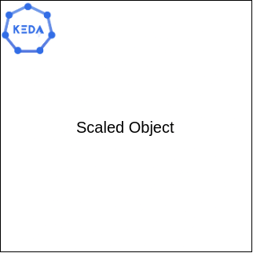

# KEDA Configuration

## KEDA Image




---

Now that we have our **Prometheus** configured and monitoring our cluster and we have already installed the **KEDA** we need to configure and spin up **KEDA** for our cluster.

First of all, we need to connect **KEDA** with our **Prometheus** instance. We have already creat the initial configuration for **KEDA**. If you execute the following command you will be able to see the initial file, `cat keda-scaledobject.yaml`.

If you _cat_ the file you will see that we are missing the **serverAddress** area witch need to be changed. (**<prometheus-host-ip>**)

So the only thing you need to do is just to open the file `keda-scaledobject.yaml` with your editor of your choice in the command line (as before) and change this field with executing the `ifconfig` command as before so to take again the IP of our machine. (Remainder we used this command on Prometheus Config). The IP should be like `172.30.1.2`.

> If you want to copy this configuration file for your system you should need to change this field according to which ip have your **Prometheus** in your system.

Now that you have configured **KEDA** file it's time to apply the configuration and run **KEDA** to our cluster. Just run the following command.

```cmd
kubectl apply -f keda-scaledobject.yaml
```{{exec}}

# Optional Step

If you want to see your scaled object you can execute this command.

```
kubectl get scaledobjects
```{{exec}}

**Perfect**! Now you have your own **KEDA** instance running into the cluster. 🥳
