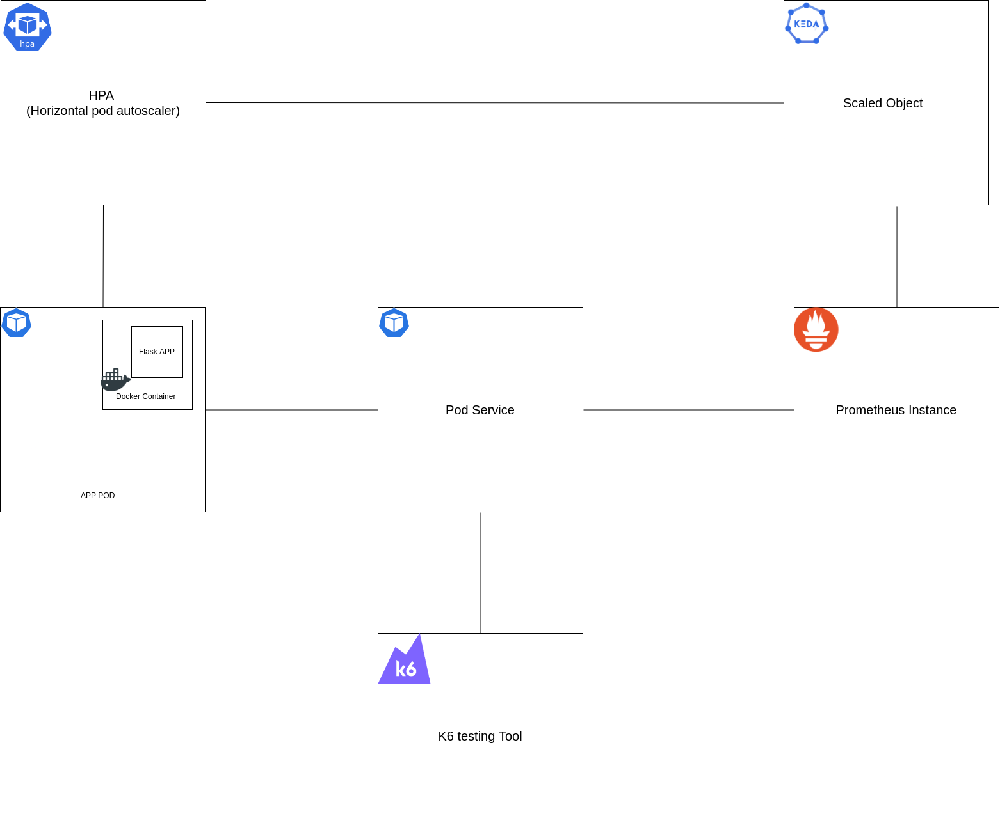

# Tutorial Results

## System Diagram

Before we see our results let's see the final diagram of our tutorial and see how all the previous images and steps connecting together in one robust system. 👇




---

Ok now that our k6 testing tool is running we can see our results.

## Prometheus

First let's go to **Prometheus Dashboard**. Click on the upper corner to the burger (🍔) menu and click the the _Traffic/Port_ from there you can type `9090` port and you will be able to see our Prometheus application.

From here the you can run some queries on the Prometheus. You can run your queries on the textbox _Expression_. You can copy and run this query: `flask_http_request_total`, witch we used it also on our **KEDA scaledobject**. And now you can go to **Graph** tab so to see the graph of our system and our metrics.(Execute this query some times so to see more resutls)

## Kubernetes POD

Finally let's see our pods to scale up. Just open a new **Tab** to our _Killercoda_ environment and run the following command.

```
kubectl get pods -o wide
```{{exec}}

And now you should see more than one Pod to our cluster.


**Congratulations**!! You have configured and run the system correct! You are read for monitoring and auto-scale your clusters. 
