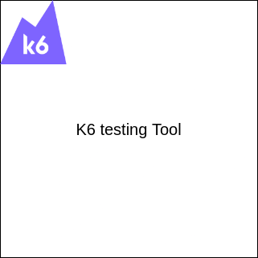

# k6 Testing Tool Configuration

## K6 Image



Well you are at the last step of our tutorial congratulations! 🥳

In this step you will _install, configure and run_ the k6 testing tool. We will use this tool so to create our virtual users for our application test.

> NOTE: We strongly recommend to read and give a visit k6's documentation page. [K6 Official page]

## Installation

First of all we need to install the k6 testing tool. You can run the following command so to install it.

```
snap install k6
```{{exec}}

## Configuration

Now that you have installed the k6 testing tool. You need to configure the js script. It is very simple we have already created an initial script the only thing you need to do is just to change the `http.get('http://<your-service-url>/get_url');` field in the `k6-testing-script.js` file.

As before you can open the `k6-testing-script.js` file with your favorite command line editor (_vim, nano, etc_).

First you need to execute the `ifconfig` command so to take the IP of our machine as before. (You have already did this before 😃). Take this IP and change the `<your-service-url>` include also the `:`. But we didn't finish our configuration we are missing one last thing.

We need also the port of our pods service. (_That we exposed previously_). You can take this port executing the following command.

```
kubectl get services -o wide
```{{exec}}

From here as you probably remember we need the port witch is between **30000 to 32767** pots numbers. Something like **31147**. You just need to copy this port number. And now open again the `k6-testing-script.js` file and add this port number after the IP that you have from previous step.

So finally you need to have a line like this: **http.get('http://172.30.1.2:31147/get_url')**;

## Run

So we are at our final step. Now you just need to run the script.

You just need to execute the following command

```
k6 run k6-testing-script.js
```{{exec}}

Perfect you have finished the tutorial and now you are running the testing.

Finally we can see our test results in the next step.

[K6 Official page]: https://flask.palletsprojects.com/en/2.3.x/
